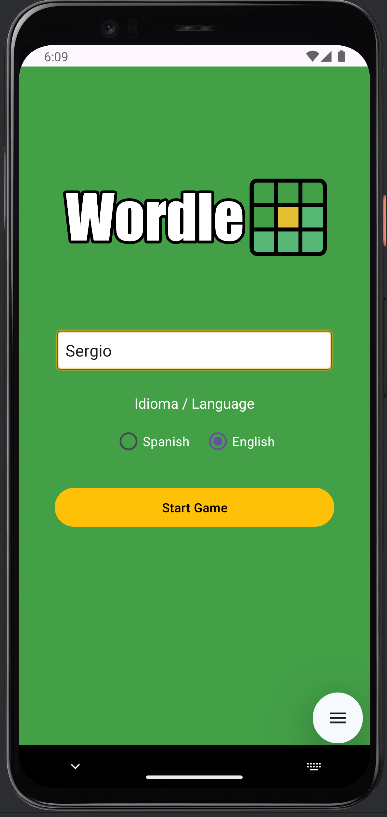
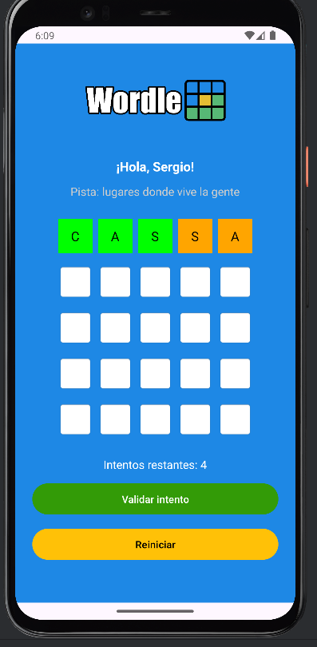
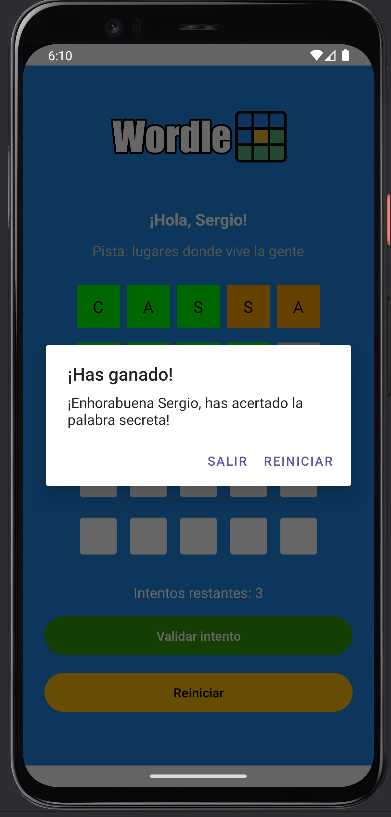

# 🧩 Wordle Multilingüe para Android

Versión personalizada del clásico **Wordle**, desarrollada en **Kotlin** con un enfoque "tradicional" basado en **Fragments**, **ViewModel**, **ViewBinding** y **Navigation Component**.  
El proyecto incorpora soporte **multilenguaje** y está diseñado para ofrecer una experiencia fluida tanto en modo vertical como horizontal.

---

## 🎮 Descripción

El objetivo del juego es adivinar una palabra secreta de **5 letras** en un máximo de **5 intentos**.  
Después de cada intento, las letras se resaltan para indicar el nivel de acierto:

- 🟩 **Verde** → letra correcta en la posición correcta.  
- 🟧 **Naranja** → letra correcta en posición incorrecta.  
- ⬜ **Gris** → letra no presente en la palabra.

---

## ✨ Características principales

- ✅ Animaciones visuales (fondo dinámico, validación de intentos, errores y animación del logo).  
- ✅ Diseño adaptable para **orientación vertical y horizontal**.  
- ✅ Conservación del estado tras rotación (palabras, colores, intentos y botones).  
- ✅ **Soporte multilenguaje**: español 🇪🇸 e inglés 🇬🇧.  
- ✅ **Selector de idioma persistente** con `SharedPreferences`.  
- ✅ **Pistas contextuales** para cada palabra, adaptadas al idioma.  
- ✅ Diálogos de victoria/derrota con opciones de **reinicio** o **salida**.  
- ✅ Soporte para **ScrollView horizontal** en pantallas pequeñas.  

---

## 🌍 Idiomas disponibles

| Idioma | Contenido |
|--------|-----------|
| 🇪🇸 Español | Lista de palabras y pistas en español. |
| 🇬🇧 Inglés  | Lista alternativa y traducciones correspondientes. |

El idioma afecta tanto a la **interfaz** como a las **palabras** y **pistas** del juego.

---

## 📸 Capturas de pantalla

  
  
  

---

## 🛠️ Tecnologías utilizadas

- **Kotlin**  
- **Android Fragments** (sin Jetpack Compose)  
- **ViewModel**  
- **ViewBinding**  
- **Navigation Component**  
- **SharedPreferences**  
